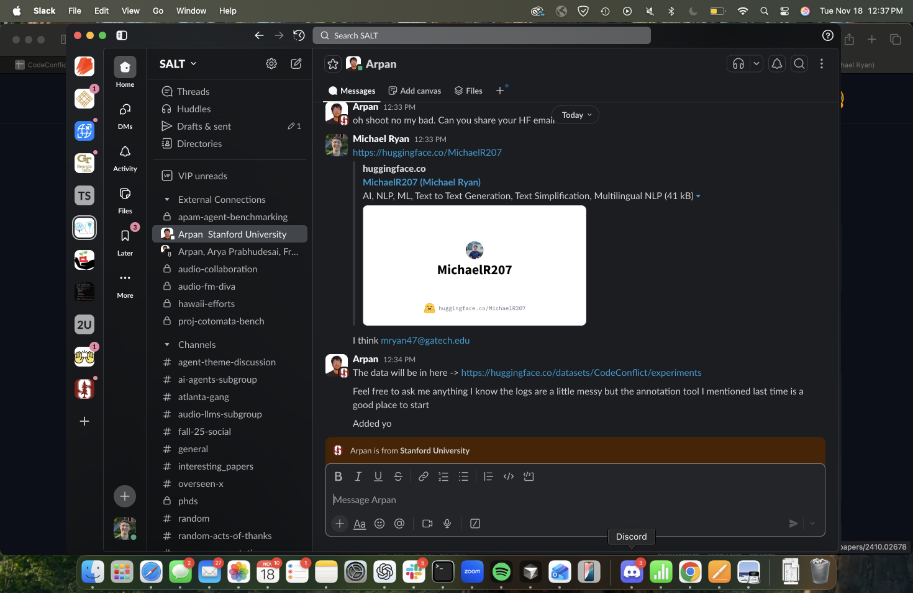

# Good Science

Research Practices and Methodologies

  
    Press Space for next page <carbon:arrow-right class="inline"/>
  

---
layout: default
---

# Overview

Key principles for conducting good science:

- **Reproducibility** - Research should be reproducible by others
- **Transparency** - Methods and data should be openly shared
- **Rigor** - Proper experimental design and statistical analysis
- **Ethics** - Responsible conduct of research
- **Collaboration** - Working together to advance knowledge

---
layout: default
---

# Research Methodology

Essential components of good research:

- Clear research questions and hypotheses
- Appropriate study design
- Valid and reliable measurements
- Proper data collection procedures
- Sound statistical analysis
- Accurate interpretation of results

---
layout: default
---

# Data Management

Best practices for handling research data:

- **Documentation** - Keep detailed records of all procedures
- **Organization** - Use consistent file naming and folder structures
- **Backup** - Maintain multiple copies of important data
- **Security** - Protect sensitive information appropriately
- **Sharing** - Make data available when possible and appropriate

---
layout: default
---

# Publication and Dissemination

Sharing research findings effectively:

- Choose appropriate venues for publication
- Follow reporting guidelines for your field
- Make preprints available when possible
- Present at conferences and workshops
- Engage with the broader community

---
layout: default
---

# Collaboration and Teamwork

Working effectively with others:

- Establish clear roles and responsibilities
- Communicate regularly and openly
- Share resources and expertise
- Respect diverse perspectives
- Build lasting professional relationships

---
layout: default
---

# Quality Assurance

Ensuring research quality:

- Peer review processes
- Independent replication
- Code and data review
- Statistical consultation
- Regular progress assessments

---
layout: default
---

# Ethical Considerations

Responsible research conduct:

- Obtain proper approvals (IRB, IACUC, etc.)
- Protect participant privacy and confidentiality
- Avoid conflicts of interest
- Report findings honestly and completely
- Give appropriate credit to collaborators

---
layout: default
---

# Tools and Resources

Supporting good science practices:

- Version control systems (Git)
- Data management platforms
- Statistical software packages
- Collaboration tools
- Reference management systems

---
layout: default
---

# Future Directions

Emerging trends in scientific practice:

- Open science initiatives
- Reproducible research workflows
- AI-assisted research
- Interdisciplinary collaboration
- Global research partnerships

---
layout: default
---

# Conclusion

Key takeaways for good science:

- Prioritize reproducibility and transparency
- Use rigorous methods and proper analysis
- Collaborate effectively with others
- Share findings openly and responsibly
- Continuously improve practices

---
layout: two-cols
title: Appendix — Calendar Import Bug (Root Cause & Fix)
---

::left::
{width=100%}

::right::
**Root Cause:**
ImportError: cannot import name 'Calendar' from 'gum.observers' triggered by gum_source.py importing a non-exported symbol or using a stale/incorrect module path.

**Fix (one line):**
Export Calendar from gum.observers or update gum_source.py to import the correct symbol; guard the import to handle missing symbols.

**PR:** [https://github.com/XenonMolecule/background-agents/compare/fix/guard-calendar-import?expand=1](https://github.com/XenonMolecule/background-agents/compare/fix/guard-calendar-import?expand=1)

**Next steps:**
- Reproduce under the background-agents venv; verify import path resolution.
- Add a regression test for missing Calendar; run unit/integration/static checks.
- After merge, bump version and sync downstream envs; update README/Troubleshooting.

---